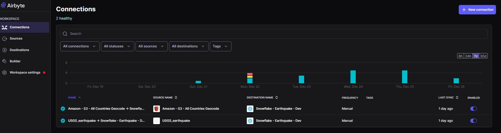
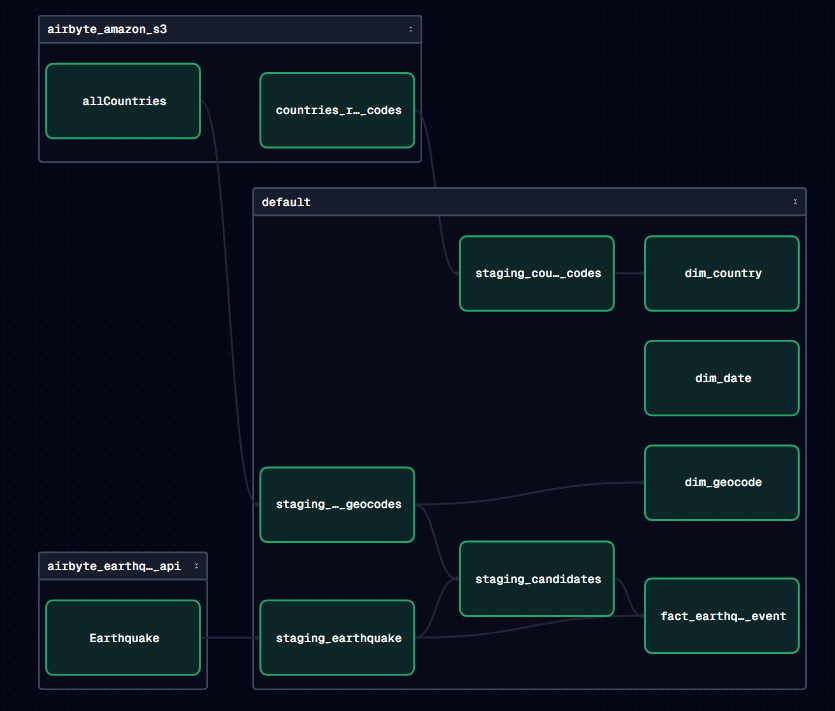
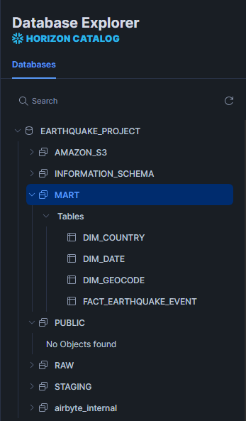
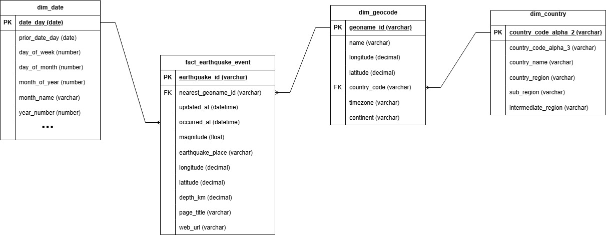

# USGS Earthquake ELT

This project implements a cloud-deployed ETL pipeline that ingests earthquake data from the USGS Earthquake API. The pipeline extracts and incrementally loads seismic event data, applies data quality checks, and transforms it using dimensional modeling to support analytical use cases. Processed data is served to an analytics layer for downstream dashboards and exploration of earthquake frequency, magnitude, and geographic trends. The architecture is designed to scale horizontally (e.g., via cloud data warehouse compute scaling), is fully automated with CI/CD, and is scheduled to run in the cloud, demonstrating production-ready data engineering best practices.

## Data Source

### USGS Earthquake API

The USGS Earthquake API provides near-real-time and historical global earthquake data in GeoJSON format. It exposes key seismic attributes including event time, magnitude, depth, latitude/longitude, location description, and update timestamps. Data is refreshed every few minutes and supports time-window and magnitude-based queries, making it well-suited for incremental ingestion, analytical pipelines, and large-scale monitoring.

**API Documentation:** https://earthquake.usgs.gov/fdsnws/event/1/

### GeoNames Geographical Database

The GeoNames dataset provides a comprehensive global gazetteer containing geographic reference data such as place names, coordinates (latitude/longitude), country and administrative divisions, feature classifications, population, and elevation. For this project, the `allCountries.txt` geocode file was downloaded from GeoNames and stored in Amazon S3, where it is used to enrich earthquake events with standardized geographic attributes such as country code.

**Data Download:** https://download.geonames.org/export/dump/

### ISO-3166 Country Codes with Regional Codes
The GeoNames dataset only had country codes. The `all.csv` was sourced from this github repository to supplement the GeoNames dataset with country region name. Like the GeoNames dataset, it is also stored in Amazon S3 and ingested by Airbyte into Snowflake.

**Data Download:** https://github.com/lukes/ISO-3166-Countries-with-Regional-Codes/blob/master/all/all.csv

## Data Architecture

## ELT

### Airbyte
Airbyte is used as the primary ingestion tool for this project. A custom Airbyte connector was built to extract earthquake data from the USGS Earthquake API. The connector configuration is defined in a declarative `earthquake_custom_connector.yml` file located in the `airbyte/` directory. Configuration details and setup instructions are documented in the README within the `airbyte` folder.

In addition, Airbyte’s standard Amazon S3 connector is used to ingest reference data from a private S3 bucket hosting the GeoNames `allCountries.txt` and a csv of ISO-3166 country codes. This enables consistent and repeatable ingestion of external geospatial reference data into the pipeline.

All of the data were loaded into a raw schema in Snowflake.

### dbt
dbt is used to transform data within Snowflake, staging raw ingested data in a **staging** schema and modeling it into **dimensional (fact and dimension) tables** within a **mart** schema. Data quality tests, including not-null, uniqueness, and relationship checks, are applied to ensure reliability and analytical correctness.

### dagster
Dagster is used as the orchestration layer for this project, leveraging an asset-based approach to model data dependencies across the pipeline. It schedules and monitors Airbyte sync jobs and triggers downstream dbt transformations using eager execution, ensuring models run automatically as soon as upstream data is updated. This setup provides end-to-end data lineage, dependency management, and observability across the ingestion and transformation layers.

### Snowflake
Snowflake is used as the central cloud data warehouse for this project, storing raw data ingested by Airbyte and supporting in-warehouse transformations with dbt to produce curated staging and mart schemas. These analytics-ready mart tables are then consumed directly by Tableau, which connects to Snowflake for semantic modeling and visualization. This design follows an ELT pattern and enables scalable transformations, governed data access, and efficient downstream analytics.

## ERD
The data model is designed using dimensional modeling principles, with a central fact table (fact_earthquake_event) capturing individual earthquake events and multiple supporting dimensions. The fact table records measurable attributes such as magnitude, depth, location coordinates, and timestamps, and links to dimensions for time and location analysis.

Location data is modeled using a lightly snowflaked structure: earthquake events reference a GeoNames-based geocode dimension (dim_geocode), which is further normalized into a country dimension (dim_country). This design avoids redundancy in country attributes while still enabling geographic rollups by country, region, and continent. A date dimension (dim_date) supports flexible time-based analysis across days, months, and years.

